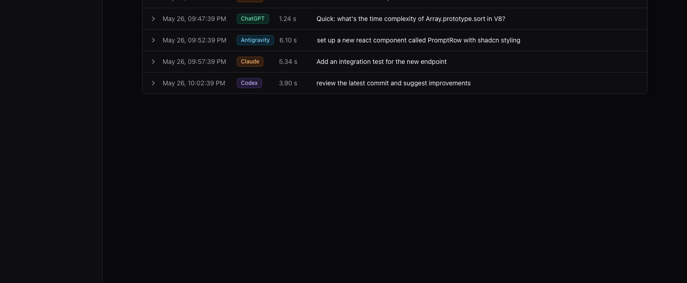

# Promptlog

[](#)
[](#)
[](#)
[](#)
[](#)
[](https://github.com/yennster/promptlog/commits/main)
[](https://github.com/yennster/promptlog/stargazers)

Local macOS app that audits the prompts you send to your AI desktop apps (Claude, ChatGPT, Codex, Antigravity), tagging each with timestamps, latency, the app, and an optional project context. Sessions are explicit (record / stop) and can be exported as PDF or XLSX.



Each session can mix multiple AI apps. Prompts are color-coded by source (Claude / ChatGPT / Codex / Antigravity) and the session detail page shows the per-app split at the top.

## Architecture

- `apps/ax-capture` — Swift CLI that reads UI state from target apps via the macOS Accessibility API, wrapped in an `.app` bundle so it gets its own TCC identity.
- `apps/daemon` — Node TS daemon. Spawns ax-capture, manages the capture loop, writes to SQLite.
- `apps/web` — Next.js App Router dashboard. Local-only, runs on `localhost:3000`.
- `packages/db` — Drizzle schema + queries against `~/.promptlog/promptlog.db`.
- `packages/shared` — Shared TypeScript types between daemon and web.

Data lives at `~/.promptlog/promptlog.db`.

## Setup

```sh
# 1. Install JS deps
pnpm install

# 2. Build the Swift AX helper (only needed once, or after Swift source changes)
pnpm build:swift

# 3. Apply DB migrations
pnpm db:migrate

# 4. Run everything (web on :3000, daemon in background)
pnpm dev
```

### Other Commands

- **Build everything for production (JS/NextJS builds + Swift AX helper)**:
  ```sh
  pnpm build
  ```

- **Run all unit & database integration tests**:
  ```sh
  pnpm test
  ```

On first run, grant **Accessibility** permission to `apps/ax-capture/AxCapture.app` in **System Settings → Privacy & Security → Accessibility**. The dashboard's `/settings` page shows current permission status.

> **Why an .app bundle, not the bare binary?** macOS TCC attributes Accessibility checks to the "responsible" app of the process tree. A bare CLI binary launched from a terminal inherits the terminal's TCC identity — so even if you toggle the binary on, macOS may check your terminal app's permission instead. Wrapping the helper in a `.app` bundle gives it its own bundle identifier and an independent TCC identity, so the toggle does what you'd expect regardless of which terminal launched it.

## Sessions

Click **Record** to start a session. You name it and optionally tag it with a **project context**, then send prompts in your AI apps. Click **Stop** when done. Each session is one row on the dashboard and can be exported as PDF or XLSX.

### Project context

A free-text label attached to the session, shown on the dashboard list, the session header, and in exported reports. It's how you'll know later what a session was *about*. Two ways to use it:

- **Code work** — set it to a repo or path, e.g. `~/Work/promptlog` or just `promptlog`. This is the manual override; the daemon also auto-tags each individual prompt with a best-effort `cwd` from your focused IDE window (VS Code / Cursor / Antigravity / Finder), but the session-level context is what reports group by.
- **Pure chat / non-code sessions** — leave it blank (the column renders `—`) or use any free-text topic like `job search`, `meal planning`, `RAG research`. There's no validation and no path-existence check — it's just a string.

Use whichever convention helps future-you searching the dashboard.
